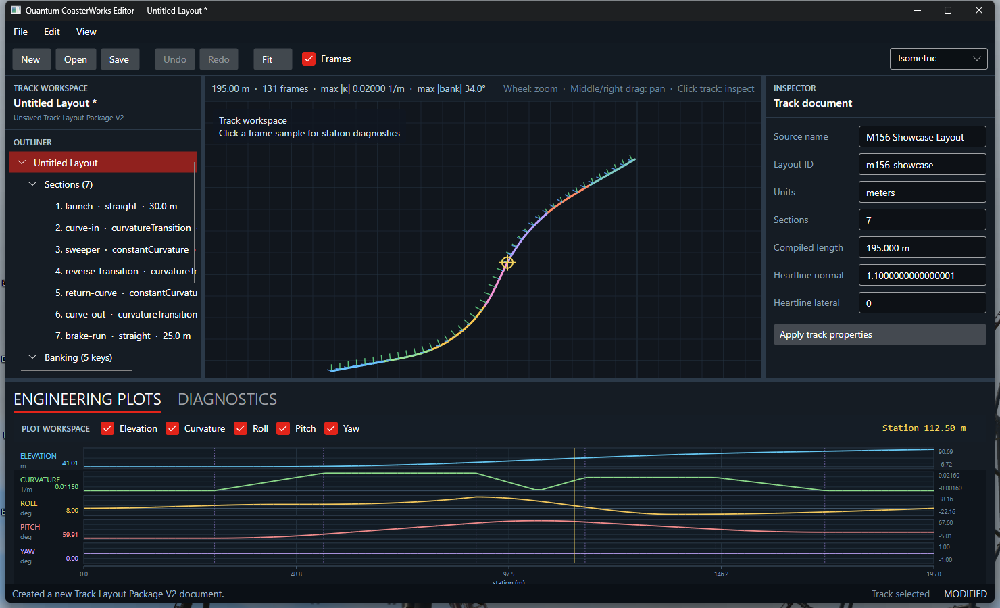

# Milestone 158.2 Engineering Plot Workspace

## Scope

Milestone 158.2 adds the first read-only engineering plot workspace to the Avalonia editor. The workspace is bottom-docked beside the existing diagnostics tab and can be resized with the existing horizontal splitter.

The workspace displays synchronized station-distance plots for:

- elevation in metres;
- unsigned centerline curvature in inverse metres;
- banking roll in degrees;
- tangent pitch in degrees; and
- tangent yaw in degrees.

Each plot can be enabled or disabled independently. Every visible plot uses the same horizontal station scale and draws the resolved section boundaries as vertical dashed markers.



## Canonical data flow

`EditorWorkspace` builds exactly one `EngineeringSnapshot` when the active compiled authoring document changes. Snapshot revisions are host-owned and advance only when a new compilation projection is required.

The data flow is:

```text
TrackAuthoringCompilation
    -> EngineeringSnapshotBuilder
    -> EngineeringSnapshot
       -> EngineeringPlotWorkspaceControl
       -> TrackSamplingService UI projection
       -> TrackViewportControl
```

`EngineeringPlotWorkspaceControl` reads the station grid, geometry, banking roll, and section boundaries directly from `EngineeringSnapshot` while rendering. `EngineeringPlotProjection` only performs presentation conversions from snapshot values, including radians-to-degrees and tangent-to-pitch/yaw conversion. It does not evaluate curves, construct frames, sample banking, or modify geometry.

`TrackSamplingService` no longer evaluates the compiled track independently. It creates the existing viewport presentation model from the same `EngineeringSnapshot`, which keeps plot and viewport sample indices aligned without introducing another backend analysis source.

## Cursor synchronization

Moving over any enabled plot resolves the nearest canonical station-grid sample. `EditorWorkspace` owns that read-only cursor state and notifies the window without rebuilding the document projection.

The shared cursor updates:

- the vertical cursor marker on every visible plot;
- the numeric station readout in the plot header; and
- the world-position locator in the technical viewport.

Clicking an existing viewport sample also updates the shared station cursor before applying the existing inspector/outliner sample selection.

## Deferred work

- Plot editing, handles, drag operations, and geometry mutation.
- Zooming, panning, station-range selection, and custom vertical scales.
- Continuous yaw unwrapping and alternate angle conventions.
- Floating/side docking and persistent workspace layout.
- GPU-backed plotting or a future high-performance 3D viewport.
- Persisting plot visibility or cursor state in editor preferences.

The M157 graph authoring backend is unchanged.
