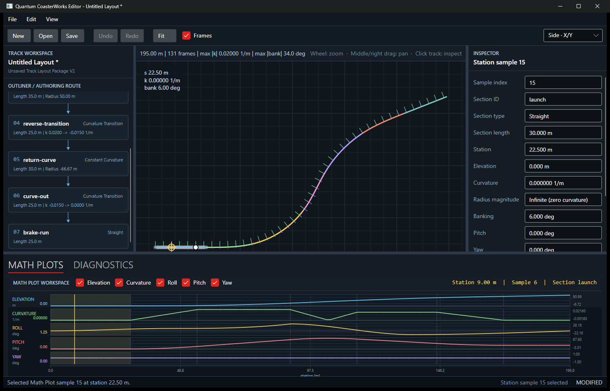
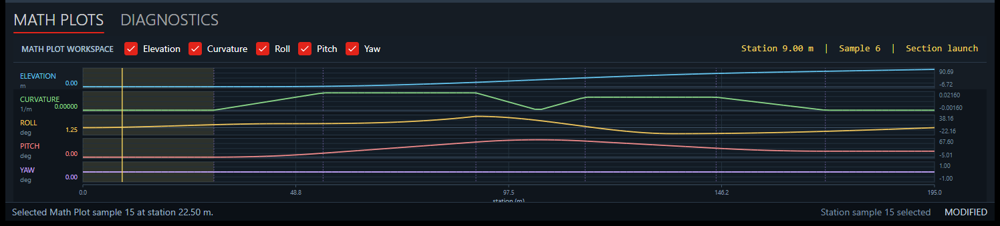

# Milestone 159 Interactive Math Plots

## Terminology decision

The user-facing feature is the **Math Plot Workspace**, and its individual
panels are **Math Plots**. Editor labels, status text, screenshots, and current
documentation use “Math Plot” or “Math Plots”; “Engineering Profile” is no
longer the product-facing name for this workspace.

Stable implementation types retain their existing names where those names
describe architecture rather than UI. In particular, `EngineeringSnapshot`
remains the immutable canonical engineering dataset. The
`EngineeringPlotWorkspaceControl`, `EngineeringPlotProjection`, and related
event types also remain internal implementation names to avoid cosmetic API
churn.

## Architecture flow

M159 adds editor interaction projections without adding another authoring or
evaluation model:

```text
Math Plot interaction
    -> EditorWorkspace station cursor, selection, and section highlight
    -> TrackAuthoringGraph reference (authoritative)
    -> TrackAuthoringGraphCompiler and existing authoring compilation
    -> immutable EngineeringSnapshot
    -> viewport + Math Plots + outliner + inspector
```

`EditorWorkspace` owns one effective section highlight. A transient pointer
hover takes precedence; when the pointer leaves, the persistent selected
section is highlighted again. The viewport, Math Plots, and outliner only
render that shared state. They do not keep competing highlight models.

The existing snapshot revision behavior is unchanged. `EditorWorkspace` builds
one `EngineeringSnapshot` for a compiled authoring revision, and
`TrackSamplingService` continues to project the viewport from that same
snapshot. Navigation resolves samples and section intervals against the
snapshot's canonical station grid and resolved-section metadata.

No Math Plot interaction edits a snapshot. The signed-radius authoring slice
still creates a candidate `TrackAuthoringGraph`, compiles it, and enters the
existing atomic undo/redo history only when validation succeeds.

## Interaction model

- Moving over any visible Math Plot moves the one shared station cursor to the
  nearest canonical sample. Every visible plot draws the same vertical cursor,
  and the viewport draws its corresponding world-position locator.
- The Math Plot header reports station distance, sample index, and section ID.
  Each plot panel reports its value at that sample when the channel is
  available.
- Clicking a Math Plot pins the nearest sample as the editor selection. The
  viewport selected-sample marker, outliner section, inspector, status text,
  and station cursor update from that selection.
- Clicking a viewport sample uses the same selection and cursor path.
- Hovering a section in the Math Plots, viewport, or outliner applies the same
  shared section highlight to all three surfaces. Selecting a section keeps it
  highlighted after hover ends.
- The inspector shows canonical, read-only station values for sample
  selections: sample index, section ID and type, section length, station,
  elevation, curvature, radius magnitude, banking, pitch, and yaw. Section
  selections show the authored section properties plus canonical values at the
  active cursor when it lies in that section, otherwise at its first sampled
  station.

The transient hover cursor and pinned sample selection remain distinct. This
allows inspection to stay pinned while the user compares nearby Math Plot
values; both are projections of the same snapshot and never create authoring
data.

## Screenshots

The self-authored M156 showcase layout demonstrates the M159 workspace,
including Math Plot terminology, canonical cursor readout, outliner/viewport
highlighting, and read-only station inspection.



The detail view shows the shared vertical cursor, highlighted section interval,
per-channel values, section boundaries, and the pinned Math Plot selection in
the status bar.



## Known limitations

- Math Plots use the complete station range with fixed vertical auto-scaling;
  shared pan/zoom and saved plot layout preferences are not implemented.
- Hover is sample-snapped. There is no backend-defined interpolation between
  canonical samples for this milestone.
- Pitch and yaw remain presentation projections of canonical snapshot tangents;
  continuous yaw unwrapping is deferred.
- Section engineering properties are read-only except for the established
  graph-backed signed-radius edit.
- Banking keys, spatial control points, section boundaries, and profile keys do
  not yet have direct Math Plot handles.
- Dynamics/time-domain channels, force plots, rates, jerk, and richer continuity
  overlays remain unavailable until canonical backend contracts exist.
- Plot pan/zoom, docking persistence, and GPU-backed rendering remain deferred.

## Future direct-editing plan

Future Math Plot handles will identify stable graph-backed authoring objects,
not realized snapshot samples. A drag or numeric edit will construct a
candidate `TrackAuthoringGraph`, run the existing compilation and validation
pipeline, and commit one undoable graph replacement only on success. A
successful commit will replace the compilation and immutable snapshot, after
which every consumer refreshes together. A rejected edit will leave the graph,
snapshot, viewport, plots, selection, dirty state, and undo history unchanged.

Direct editing should proceed incrementally: banking/profile keys and explicit
section boundaries first, then spatial control points and additional authored
targets after stable authoring identities and backend conventions are proven.
Realized Math Plot samples will remain read-only diagnostics.
