# M167.3 Latest-Wins Evaluation Scheduling

## Scope

M167.3 adds a thin frontend-neutral coordinator above `TrackAuthoringSession`.
It does not add Inspector scrubbing, pointer handling, viewport integration,
selection remapping, force authoring, incremental compilation, parallel
compilation, or a general job system.

`TrackAuthoringSession` remains the sole authority for committed and presented
state, dirty state, persistence, history, current candidate identity, and exact
commit eligibility. The coordinator owns only queued/running work, the
one-latest-pending policy, cancellation hints, throttling, completion tasks, and
instance metrics.

## Contract

The public scheduling surface is:

- `TrackAuthoringEvaluationCoordinator`;
- `AuthoringEvaluationSchedulerOptions`;
- `AuthoringEvaluationSubmission`, containing an immutable request and completion
  task;
- `AuthoringEvaluationRequest`, containing session, committed base, transaction,
  provisional, and scheduling-request identities;
- `AuthoringEvaluationOutcome`, containing status, candidate when available,
  diagnostics, fault summary, and timings;
- `AuthoringScheduledCommitResult`; and
- `EvaluationSchedulerSnapshot`.

`SubmitProvisionalEdit` first asks the session to reserve the next provisional
revision against the transaction's captured before-state. Evaluation later uses
that immutable graph and ancillary-state snapshot. Publication returns to the
session, which accepts the candidate only if all of these still match:

1. authoring session ID;
2. committed base revision;
3. transaction revision;
4. newest provisional edit revision;
5. exact captured source graph and ancillary state.

Existing `TrackAuthoringSession.SubmitCandidate` remains synchronous. It now uses
the same reserve/evaluate/publish split, so synchronous and scheduled paths share
candidate construction and exact acceptance semantics.

## Scheduling state

```mermaid
stateDiagram-v2
    [*] --> Idle
    Idle --> Running: submit leading revision
    Running --> RunningWithPending: submit trailing revision
    RunningWithPending --> RunningWithPending: newer submit replaces pending
    Running --> Idle: completion and no pending
    RunningWithPending --> Running: completion; start latest pending
    Running --> Idle: cancel or stale completion
    RunningWithPending --> Running: pending cancelled/coalesced
    Idle --> [*]: dispose
    Running --> [*]: dispose after running work returns
```

Serialized background mode never has more than one evaluator invocation running.
It retains at most one pending request. Replacing that pending request produces a
`Coalesced` outcome without starting evaluation. The leading request starts
immediately. A configurable minimum interval limits subsequent starts while still
allowing continuous periodic feedback; it is not a pause-only debounce.

The background preset uses a configurable initial maximum rate of 30 evaluations
per second. A caller may provide another interval, including zero. The final
revision frozen for commit bypasses the interval.

## Exact final-revision commit

`CommitLatestAsync` freezes the active transaction's newest reserved provisional
revision:

- if its exact valid or invalid candidate is already published, the session's
  existing `Commit` method is called immediately;
- if it is pending or running, the coordinator retains that work, marks it
  final-priority, and awaits its completion without blocking the caller thread;
- submissions to that transaction are rejected while the revision is frozen;
- an accepted valid candidate commits without reevaluation or compilation;
- an accepted invalid candidate produces the session's structured
  `CandidateRejected` commit result; and
- cancellation, staleness, coalescing, or evaluator fault completes the wait
  without calling `Commit`.

The older last-good presented candidate is never substituted for the frozen
revision. A successful changed commit still creates exactly one history entry.

## Cancellation and invalidation

Cancellation is an optimization boundary, not the correctness mechanism.
Cancellation is checked:

- before reservation/candidate construction where a caller token is already
  cancelled;
- before evaluator invocation;
- after graph application/validation/compilation returns;
- before package preparation returns a candidate; and
- before publication.

The current compiler has no cooperative cancellation parameter. A compile already
in progress may finish. Transaction cancel calls the session immediately to restore
committed presentation and cancels running/pending scheduler tokens. Open/new
session replacement changes `AuthoringSessionId`. In both cases a late result is
incapable of publication because the session's structural acceptance check fails.

A scheduler/evaluator exception produces a `Faulted` outcome containing request
identity, phase, exception type/message, and timing. It does not close or replace
the session.

## Execution mode and thread-safety statement

Synchronous mode is the default. It is deterministic, preserves the M167.2 calling
behavior, and is suitable for small routes and tests.

Serialized background mode is opt-in. Repository evidence shows that authoring
graphs and section definitions copy their inputs, and every successful candidate
constructs its own graph, compile result, document, runtime, projections, and
canonical package JSON. Tests establish synchronous/background parity for straight
and spatial routes, repeatability, and no overlap inside one coordinator. The
spatial compiler path constructs a per-candidate G-Shark adapter, but this milestone
does not establish a general thread-safety contract for all external G-Shark code
or for multiple coordinators compiling concurrently. Background-by-default is
therefore not justified yet.

The coordinator may publish session state from its serialized worker. Session field
access and mutation are synchronized, but the coordinator never touches controls,
dispatchers, renderer state, or document views. A future frontend must await the
immutable completion outcome and marshal any control/document/viewport work to its
own UI thread.

## Metrics

Metrics are coordinator-instance-owned. `AuthoringEvaluationTiming` records per
outcome values, and `EvaluationSchedulerSnapshot` contains cumulative totals.

| Counter | Meaning |
|---|---|
| `Submitted` | requests successfully reserved by the session |
| `Started` | evaluator invocations begun |
| `Completed` | started evaluator invocations that returned, cancelled, or faulted |
| `Accepted` | current valid candidates published by the session |
| `Rejected` | current expected-invalid candidates published for diagnostics |
| `Stale` | results structurally refused or invalidated before start |
| `Coalesced` | pending requests replaced by a newer request |
| `CancelledBeforeStart` | cancelled/coalesced requests that never invoked the evaluator |
| `Cancelled` | outcomes stopped by a cancellation signal |
| `Faulted` | unexpected evaluator or publication faults |
| `MaximumPendingDepth` | observed trailing queue depth; bounded to one |

Timing totals cover queue wait, candidate application, validation/compilation,
package preparation, total evaluation, submit-to-result, and submit-to-present.
Compiler invocations are also recorded per outcome and cumulatively; a route-valid,
non-empty started candidate invokes the graph compiler once. Commit, undo, and redo
invoke it zero times.

## Verification

Headless controllable-evaluator tests cover synchronous parity, one-running plus
one-latest-pending behavior, coalescing, stale valid/invalid isolation, cancellation
before and during non-cooperative work, transaction/session invalidation, structured
faults, exact commit waiting, last-good rejection, final-priority throttle bypass,
single-worker execution, and deterministic fake-clock metrics.

Production tests cover straight-section evaluation, repeatability, explicit-banking
compilation rejection, spatial/G-Shark parity, one compiler invocation per started
candidate, zero-compilation commit, and non-overlapping production candidate work.
Dependency coverage rejects frontend and renderer references from
`Quantum.Application`.

## Recommended M167.4 integration point

Keep `EditorWorkspace.ApplyGraphEdit` as the existing one-shot path. Add one
`TrackAuthoringSession` and one opt-in coordinator per active track document at the
document/workspace service boundary. In `InspectorPaneControl`, begin a transaction
when a numeric scrub gesture starts, submit immutable absolute replacement
operations on value changes, and await `AuthoringEvaluationSubmission.Completion`.
On the Avalonia dispatcher, apply only an accepted current session snapshot to the
document projections and viewport. On gesture completion call `CommitLatestAsync`;
on escape, pointer loss, document close, open, or new, call transaction cancellation
or session replacement before updating controls. The coordinator itself must remain
unaware of Avalonia.
