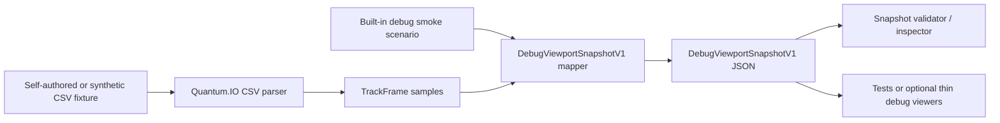

# Quantum CoasterWorks Technical Preview 0.1 Scope

## Release Intent

Technical Preview 0.1 is a backend-first foundation release for Quantum CoasterWorks. Its purpose is to prove that the core coaster-domain backend can import a narrow, self-authored fixture, sample a track centerline, expose stable orientation and train diagnostic data where available, and hand renderer-agnostic debug output to a thin viewer or test consumer.

This release should feel focused and credible, not like a random prototype. It is also not a promise of a complete coaster editor or a full NoLimits replacement. The preview is a public foundation slice: enough working backend behavior to evaluate the architecture, contracts, tests, and debug workflow before expanding product scope.

Technical Preview 0.1 is not production-ready.

## Required Scope

- Keep the `Quantum.*` backend projects engine-agnostic and free of hard dependencies on Unity, Unreal, Avalonia, Silk.NET, OpenTK, or other frontend/rendering frameworks.
- Support self-authored NoLimits CSV fixture import and testing only. Fixtures must come from layouts authored by the project owner or contributing author with permission to include them.
- Produce sampled centerline output with deterministic station-distance semantics suitable for tests and debug consumers.
- Include optional orientation and banking frame output when supported by the current backend sampling path.
- Include train pose, bogie, body, or placeholder diagnostics when supported by the current train placement/export path.
- Provide a renderer-agnostic debug viewport snapshot/export contract for centerlines, frames, debug lines, boxes, and optional train pose data.
- Allow a basic viewer or debug consumer to be Unity, Unreal, standalone, command-line, or test based. The frontend remains non-final.
- Keep tests passing for the solution.
- Document clearly that this preview is an early technical foundation, not production-ready software.

## Explicit Non-Goals

- Technical Preview 0.1 is not a full NoLimits replacement.
- It does not include a full polished editor.
- It does not include or depend on third-party coaster layouts, scenery, media, or proprietary assets.
- It does not require a commitment to Unity, Unreal, Avalonia, Silk.NET, OpenTK, or any other final frontend or renderer.
- It does not require ray tracing, advanced PBR, cinematic rendering, VR, or high-fidelity presentation visuals.
- It does not require full NoLimits project import, complete simulator compatibility, train asset import, environment import, scripting compatibility, or editor parity.

## Release Quality Bar

Before Technical Preview 0.1 is considered releasable:

- The project builds from a clean checkout.
- `dotnet test QuantumCoasterWorks.sln --nologo` passes.
- The sample self-authored fixture works through the documented import/test/debug path.
- Repository files do not contain machine-specific absolute paths.
- No proprietary, third-party, or permission-unclear assets are committed.
- No backend project has a hard dependency on a frontend renderer or engine.
- Public docs explain the preview status, supported slice, and non-goals.

## Release-Readiness Checklist

Use this checklist as the final backend release gate for Technical Preview 0.1:

- [ ] `dotnet test QuantumCoasterWorks.sln --nologo` passes from a clean checkout.
- [ ] The built-in `DebugViewportSnapshotV1` sample command writes valid JSON.
- [ ] At least one self-authored or synthetic CSV fixture can be bridged to `DebugViewportSnapshotV1` JSON.
- [ ] The snapshot validator accepts the generated built-in sample and CSV-derived sample.
- [ ] Generated JSON artifacts are either omitted from source control or included with an explicit release reason.
- [ ] `Quantum.*` projects remain free of Unity, Unreal, Avalonia, Silk.NET, OpenTK, Veldrid, renderer, or frontend dependencies.
- [ ] Public docs describe the backend-only workflow and command surface.
- [ ] Public docs do not describe Technical Preview 0.1 as a full NoLimits replacement, polished editor, renderer, paid alpha, ray-tracing target, or PBR/high-fidelity visualization release.
- [ ] Fixture docs continue to state that CSV support is a narrow debug/test bridge for self-authored or synthetic inputs.

## Backend Command Workflow

Generate the built-in backend debug snapshot:

```powershell
dotnet run --project Quantum.Debug -- debug-viewport-snapshot-v1 artifacts/debug-viewport/DebugViewportSnapshotV1.sample.json
```

Generate a snapshot from a sampled-frame CSV fixture:

```powershell
dotnet run --project Quantum.Debug -- debug-viewport-snapshot-v1-from-csv Quantum.Tests/IO/Fixtures/Milestone7.synthetic.straight_line.centerline_frames.csv artifacts/debug-viewport/Milestone7.synthetic.straight_line.snapshot.json
```

Validate and inspect a generated snapshot:

```powershell
dotnet run --project Quantum.Debug -- debug-viewport-snapshot-v1-validate artifacts/debug-viewport/DebugViewportSnapshotV1.sample.json
```

The validator prints contract/version identity, units, source fixture name, centerline/frame/line/box counts, train pose presence, and pass/fail status. Generated JSON should stay local by default unless a release package intentionally includes a specific artifact.

## Current Backend Pipeline



The pipeline is intentionally renderer-neutral. Viewers, if used, consume JSON at the adapter boundary and own all engine, renderer, camera, material, and coordinate-conversion decisions outside the backend.

## Why A Focused Vertical Slice

Starting with a focused vertical slice does not mean the architecture is weak or unambitious. It means Quantum CoasterWorks is proving the parts that future features depend on: clean backend boundaries, stable centerline sampling, frame and distance semantics, train placement diagnostics, fixture policy, export contracts, and tests.

Once those foundations are reliable, larger editor, visualization, import, physics, and rendering workflows can grow from contracts that have already been exercised instead of from frontend-specific prototypes.

