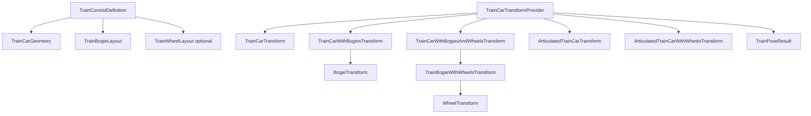

# Backend Train Transform API Architecture Review

Date: 2026-05-06  
Scope: Backend-only train transform hierarchy in `Quantum.Track`  
Baseline: commit `705da16`, tests previously green (587 passing), no Unity/rendering changes

## Executive Summary
The current train-transform API is functionally stable and well-covered by tests. The main architecture risk is not correctness, but long-term maintainability: a flat namespace, mixed matrix precision, mutable collection exposure, and a provider that already bundles multiple responsibilities.

## Hierarchy (Current)

## 1) Naming Consistency
Strengths:
- Type names are mostly explicit and domain-legible.
- `*Layout` vs `*Transform` separation is clear.

Weak spots:
- Mixed verb style in provider API: `GetCarTransforms` vs `Evaluate*`.
- Layered aggregate names are increasingly long (`TrainCarWithBogiesAndWheelsTransform`, `ArticulatedTrainCarWithWheelsTransform`) and will become harder to scale.
- `ArticulatedTrainCarTransform.CenterDistance` currently mirrors `OriginalBody.Distance`; the name suggests a potentially different semantic meaning.

## 2) Namespace Organization
Strengths:
- All relevant train-transform types are co-located in `Quantum.Track`, making discovery easy.

Weak spots:
- `Quantum.Track` is now broad (track eval, sections, camera, train transforms, debug gizmos), so cohesion is weakening.
- Two `TrackFrame` types (`Quantum.Splines.TrackFrame`, `Quantum.Track.TrackFrame`) already require aliasing and mental context switching.

## 3) Immutable / Value-Object Consistency
Strengths:
- Most domain objects are immutable in practice (constructor-only assignment + get-only properties).

Weak spots:
- `TrainPoseResult.Cars` and `TrainBogieWithWheelsTransform.Wheels` expose mutable arrays directly.
- `TrainPoseResult` stores `TrainConsistDefinition` by reference (no defensive snapshot), so immutability depends on upstream discipline.
- `TrainCarGeometry`, `TrainBogieLayout`, `TrainWheelLayout` behave like value objects but use reference equality semantics.

## 4) Provider Layering Consistency
Strengths:
- `TrainCarTransformProvider` provides a clear backend entry point for train pose evaluation.
- Overloads from `TrainConsistDefinition` are practical and reduce call-site boilerplate.

Weak spots:
- Provider currently mixes:
  - input validation,
  - track sampling,
  - articulation basis construction,
  - wheel local layout generation,
  - aggregate assembly.
- This is manageable now, but trends toward a "god service" as new variants are added.

## 5) Future Extensibility
Strengths:
- Hierarchy already supports articulated + wheel-enabled paths.
- Composition-based aggregates are easy to read.

Weak spots:
- Fixed assumptions are embedded:
  - two bogies per car (`bogieIndex` 0/1),
  - wheel pairing by index parity,
  - local wheel Z always `0`.
- Extending to alternate bogie counts or non-paired wheelsets will require provider surgery, not extension points.

## 6) Potential Duplication
Observed duplication:
- Repeated finite/positive validation patterns across layout/definition types.
- Multiple evaluation passes in `EvaluateArticulatedTrainWithWheels` (articulated path + wheel path) can duplicate frame sampling work.
- Matrix conversion path repeatedly crosses `TrackFrame -> Matrix4x4 -> Matrix4x4d`.

## 7) Public API Clarity
Strengths:
- API methods and DTOs are generally understandable from names alone.
- Error messages are explicit and test-covered.

Weak spots:
- Public shape has many near-duplicate aggregates; call-sites may struggle to pick the right level (`with bogies`, `with bogies and wheels`, `articulated`, `pose`).
- `TrainPoseResult` implies "final top-level output" but is currently tied to one specific hierarchy (`ArticulatedTrainCarWithWheelsTransform[]`).

## 8) Serialization Friendliness
Strengths:
- Property-only DTO style is serialization-friendly for many serializers.

Weak spots:
- Readonly structs + constructor-only init can be serializer-dependent for round-trip deserialization.
- Mutable arrays are exposed directly and may produce accidental shared-state mutation after deserialization.
- No explicit serialization contract layer (DTO boundary) yet.

## 9) Matrix / Frame Type Consistency
Strengths:
- Frames are consistently represented with `Vector3d` basis vectors.

Weak spots:
- Mixed matrix precision in a single hierarchy:
  - `TrainCarTransform.Matrix` uses `Matrix4x4` (float).
  - `BogieTransform`, `WheelTransform`, articulated matrix use `Matrix4x4d`.
- This introduces avoidable conversion churn and precision asymmetry.

## 10) Potential Future Pain Points
- API surface growth by combinatorics (`car`, `car+bogies`, `+wheels`, `+articulated`, future variants).
- Precision/interop ambiguity unless matrix policy is standardized.
- Mutable array exposure creates hidden integrity risk in otherwise immutable design.
- Flat namespace will make discoverability and ownership harder as subsystems grow.

## Strengths Recap
- Strong test coverage around transform behavior and error messaging.
- Good domain decomposition into definition/layout/transform concepts.
- Backend-only and renderer-agnostic design is preserved.
- Deterministic transform outputs with explicit validation.

## Recommended Refactor Directions (No Behavior Change)
Priority A (low-risk cleanup):
1. Standardize provider verb naming (`Evaluate*` vs `Get*`).
2. Stop exposing mutable arrays directly from public models (copy-on-write or `IReadOnlyList<T>` facade).
3. Introduce shared validation helpers for finite/positive checks.
4. Clarify docs/comments for `CenterDistance` semantics.

Priority B (medium, still non-behavioral if staged):
1. Split namespace folders/namespaces:
   - `Quantum.Track.Train.Definition`
   - `Quantum.Track.Train.Transforms`
   - `Quantum.Track.Train.Providers`
2. Introduce a top-level `TrainPose` contract interface/DTO boundary for serialized output.
3. Consolidate matrix policy (all `Matrix4x4d` internally, with explicit float conversion at API edge if needed).

Priority C (future architecture hardening):
1. Decompose `TrainCarTransformProvider` into internal collaborators:
   - car sampler,
   - bogie solver,
   - wheel layout solver,
   - articulation solver,
   - aggregate composer.
2. Add extension seam for non-2-bogie/non-paired wheel configurations.
3. Consider value-equality semantics for definition/layout types.

## Suggested Future Subsystem Boundaries
- `Definition`: static train spec objects (`TrainConsistDefinition`, layout/geometry types).
- `Sampling`: distance-to-frame evaluation adapters (`TrackEvaluator` integration).
- `Kinematics`: bogie/articulation/wheel local offset solving.
- `Pose Assembly`: compose hierarchical output DTOs.
- `Interop`: matrix/frame conversion and serialization-facing DTOs.

## Small API Cleanup Opportunities (Non-Breaking Candidates)
- Add new alias methods with consistent verbs while keeping old methods temporarily.
- Add non-mutating accessors (e.g., `IReadOnlyList<T>`) alongside existing arrays before eventual deprecation.
- Add XML docs that explicitly state precision and frame conventions on every transform model.

## Final Assessment
Current API is stable and production-usable for the present scope. The next architecture win is tightening contracts (immutability + precision consistency + subsystem boundaries) before additional transform variants are introduced.
